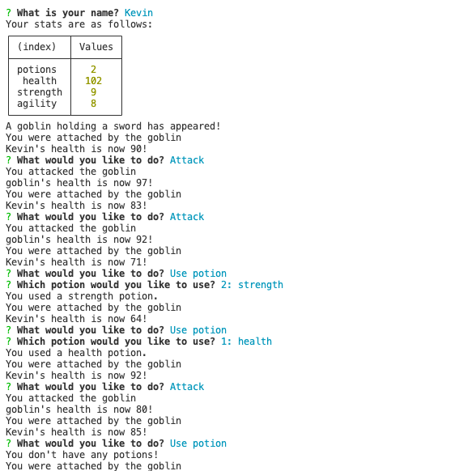

# Jest_another_RPG

### User Story
As a user I would like a command line aplication game. This should be a battle simulator that allows me to battle through several rounds, taking a potion of choice in between each round. This application should keep track of my potions, health, strength and agility. Each battle should display my health and the enemie's health after each attack.
### Features
This is a command line application that is a battle siumulation game
This app will keep track of player's potions, health, strength and agility.
During each battle sequence the player's health and the enemy's health are tracked and displayed.
At the end of each battle the player will have the option to use any remaining potions. 

### badges

## Table of Contents

- [installation](#installation)
- [contribution guidelines](#contribution)
- [Test Instructions](#testing)
- [License](#license)
- [Questions](#questions)

### Installation
1. Please clone the github repo here :
https://github.com/Vinyldude8896/Jest_another_RPG
2. Run npm install to install the dependecies.
3. Then at the root folder, run npm start
4. You should then be prompted for input to start the game

### Contribution Guidelines
Current contributers:
Kevin Reid : https://github.com/Vinyldude8896  

### Testing
To test this app: 
1. Please clone the github repo here :
https://github.com/Vinyldude8896/Jest_another_RPG
2. Run npm install to install the dependecies.
3. Then at the root folder, run npm start
4. You should then be prompted for input to start the game
5. Enter your name
6. Cycle through the battles
7. After each battle try using a potion
### Questions
    email address : kevinnivek@me.com
    - additional instructions 
    I can be contacted by phone as well, but prefer email contact first.

### Image of example readme.md

### 
link to video on how this app works 
https://drive.google.com/file/d/1LI59_oI8PFsNlTa91-8nnvyq7uMW643H/view

